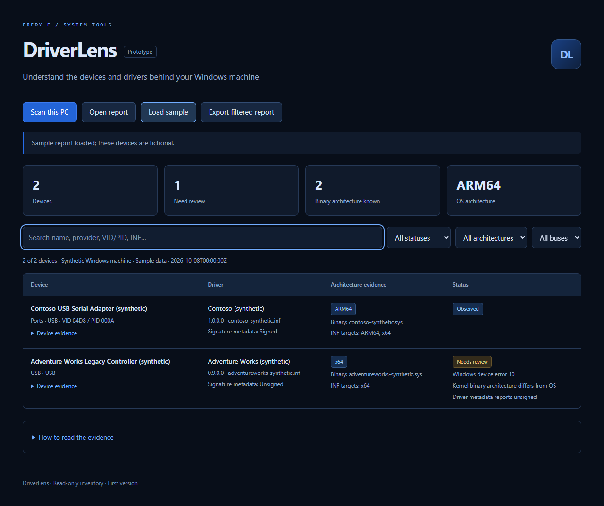

<p align="center">
  
</p>

<p align="center">
  <a href="https://github.com/Fredy-E/DriverLens/actions/workflows/verify.yml"></a>
  
  
  
  
</p>

## What this is

DriverLens identifies device VID/PID, driver metadata, INF architecture targets, and the PE machine type of resolvable kernel driver files. It flags Windows device errors, metadata indicating an unsigned driver, and known kernel/OS architecture differences.

<p align="center">
  
  <br><sub>Synthetic sample report — no real device data.</sub>
</p>

## Run

**Windows — one click.** Double-click **`Start-DriverLens.cmd`**. It starts the local server (or reuses a running one whose `/ping` readiness pixel it can verify), waits for it to become ready (bounded), and opens the UI in your browser. If the address never serves the helper, it reports the timeout instead of opening the browser to something else.

Requirements: [Node.js 22+](https://nodejs.org) and [PowerShell 7](https://aka.ms/powershell) on PATH.

**Manually:**

```powershell
node server.cjs
```

Then open **http://127.0.0.1:8781** and click **Scan this PC**. No npm install is needed to run the tool. The collector uses PowerShell and CIM; it does not change driver or system settings. It writes one local JSON report beside the application. If PowerShell 7 is installed outside PATH, set `DRIVERLENS_POWERSHELL` to its executable before starting the server. The tool does not bypass execution policy.

> **Opened from disk? It waits for the helper.** Browser pages cannot start local programs (by design) — there is no zero-click launch. Double-click `Start-DriverLens.cmd` to run the helper; a page opened from disk connects itself automatically once the helper's `/ping` pixel really answers (it never switches to an unrelated service on the port). Use `127.0.0.1`, not `localhost` (rejected by design).

Alternatively, collect a report yourself:

```powershell
pwsh -NoProfile -File .\Collect-DriverLens.ps1 -OutputPath .\driver-report.json
```

Then open `index.html` and select the report using **Open report**. **Load sample** needs the local server; the bundled sample is explicitly fictional.

## Troubleshooting

- **"Cannot reach the local helper"** — the helper isn't running yet. Double-click `Start-DriverLens.cmd` in this folder (or run `node server.cjs`); a page opened from disk connects automatically (it re-checks every 2 seconds).
- **"Inventory failed…"** — PowerShell 7 is missing or blocked: install it, or set `DRIVERLENS_POWERSHELL` to the full path of `pwsh.exe`.
- **"DriverLens server did not become ready…"** — port 8781 is not serving the helper (or another program owns it). The launcher deliberately does not open the browser in that case; stop whatever is using the port and try again, or run `node server.cjs` to see the server's error.
- **"Use the local 127.0.0.1 address."** — replace `localhost` in the URL with `127.0.0.1`.

## Evidence limits

INF targets describe package declarations, not the loaded binary. Kernel architecture is unknown when a service path cannot be resolved, is outside the Windows directory, or the binary cannot be read. “Observed” is not a compatibility certification. Signature state comes from Windows PnP metadata (`IsSigned`) and is displayed as metadata only — it is not a fresh cryptographic verification of any file. Readiness is identified by the helper's `/ping` response (a decoded 42-byte 1×1 GIF pixel in the browser; `image/gif` with the exact 42-byte length in the launcher) — a liveness/identity signal, not cryptographic authentication.

## Privacy

The collector omits hostnames, usernames, raw instance IDs, serial fields, and full driver paths; a digest supports local comparison. Device names, hardware VID/PID, provider, and version remain in the report. No report is uploaded. `driver-report.json`, generated `test-fixtures/`, `node_modules/`, and any `*.log` files are git-ignored; check output and logs stay on this machine and contain no device data.

## Checks

```powershell
# Collector fixture checks (synthetic PE/INF fixtures; PowerShell 7)
pwsh -NoProfile -File .\Test-Collector.ps1 -FixtureDirectory .\test-fixtures

# Dev-only tooling for the checks below (Playwright; no browsers downloaded here)
npm ci

# Launcher invariants + server integration tests (spawns real servers; synthetic collectors only)
npm run test:launcher
npm run test:integration

# Browser test: file:// auto-connect + synthetic report import; saves docs/images/app.png
npm run test:browser
```

The integration tests spawn the real server (production entrypoint, plus a harness with an injected synthetic collector) and exercise the exact loopback `Host` / `Origin` / `X-DriverLens-Scan` guards, the fixed static allowlist, path-traversal resistance, malformed request-target handling (a 400 that never crashes the helper), foreign absolute request targets, `/ping` readiness, and the failed/pending collector paths over real HTTP. The browser test opens `index.html` from disk, watches it auto-connect to the helper (whether it comes up later or is already running), proves the page never adopts an unrelated service squatting on port 8781, and imports a synthetic report — it uses system Chrome/Edge, or run `npx playwright install chromium` first. No test ever runs a real device inventory. CI runs the fixture checks, launcher invariants, integration tests, and the browser test on a Windows ARM64 runner (badge above). See [docs/COMPATIBILITY.md](docs/COMPATIBILITY.md) for exactly what is and is not verified — x86/x64 hardware, for example, is not.

## Next

Report comparisons, richer package evidence, and an installable desktop shell after validating the collector across several Windows versions and device classes.

[PE format reference](https://learn.microsoft.com/en-us/windows/win32/debug/pe-format)

## See also

[ARM64 Compatibility Radar](https://github.com/Fredy-E/ARM64-Compatibility-Radar) · [MeshLab Mini](https://github.com/Fredy-E/MeshLab-Mini) · [Diagnostic Scan Diff](https://github.com/Fredy-E/Diagnostic-Scan-Diff) · [Offline Museum Kit](https://github.com/Fredy-E/Offline-Museum-Kit) — small local-first tools built for Windows-on-ARM work.

## License

MIT — see [LICENSE](LICENSE).
