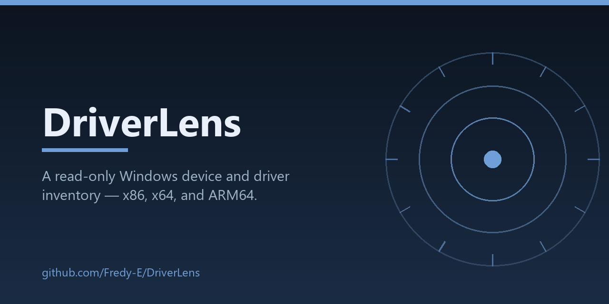

<p align="center">
  
</p>

<p align="center">
  <a href="https://github.com/Fredy-E/DriverLens/actions/workflows/verify.yml"></a>
  
  
  
  
</p>

## What this is

DriverLens identifies device VID/PID, driver metadata, INF architecture targets, and the PE machine type of resolvable kernel driver files. It flags Windows device errors, metadata indicating an unsigned driver, and known kernel/OS architecture differences.

## Run

**Windows — one click.** Double-click **`Start-DriverLens.cmd`**. It starts the local server (or reuses a running one) and opens the UI in your browser.

Requirements: [Node.js 22+](https://nodejs.org) and [PowerShell 7](https://aka.ms/powershell) on PATH.

**Manually:**

```powershell
node server.cjs
```

Then open **http://127.0.0.1:8781** and click **Scan this PC**. No npm install is needed. The collector uses PowerShell and CIM; it does not change driver or system settings. It writes one local JSON report beside the application. If PowerShell 7 is installed outside PATH, set `DRIVERLENS_POWERSHELL` to its executable before starting the server. The tool does not bypass execution policy.

> **Opened from disk? It still works — it auto-connects.** Browser pages can't start local programs (by design), so the helper must be running: double-click `Start-DriverLens.cmd`. A page opened from disk waits for the helper and connects itself automatically the moment it is up. Use `127.0.0.1`, not `localhost` (rejected by design).

Alternatively, collect a report yourself:

```powershell
pwsh -NoProfile -File .\Collect-DriverLens.ps1 -OutputPath .\driver-report.json
```

Then open `index.html` and select the report using **Open report**. **Load sample** needs the local server; the bundled sample is explicitly fictional.

## Troubleshooting

- **"Cannot reach the local helper"** — the helper isn't running yet. Double-click `Start-DriverLens.cmd` in this folder (or run `node server.cjs`); a page opened from disk connects automatically within ~2 seconds.
- **"Inventory failed…"** — PowerShell 7 is missing or blocked: install it, or set `DRIVERLENS_POWERSHELL` to the full path of `pwsh.exe`.
- **"Use the local 127.0.0.1 address."** — replace `localhost` in the URL with `127.0.0.1`.

## Evidence limits

INF targets describe package declarations, not the loaded binary. Kernel architecture is unknown when a service path cannot be resolved, is outside the Windows directory, or the binary cannot be read. “Observed” is not a compatibility certification. WMI signature metadata is displayed as metadata, not a fresh cryptographic verification.

## Privacy

The collector omits hostnames, usernames, raw instance IDs, serial fields, and full driver paths; a digest supports local comparison. Device names, hardware VID/PID, provider, and version remain in the report. No report is uploaded, and `driver-report.json` plus generated fixtures are git-ignored.

## Checks

```powershell
.\Test-Collector.ps1 -FixtureDirectory .\test-fixtures
```

This creates local synthetic PE fixtures and tests architecture recognition, malformed-header handling, and INF decoration parsing. CI runs the collector tests plus Node syntax checks on a GitHub Windows-ARM64 runner (badge above).

## Next

Report comparisons, richer package evidence, and an installable desktop shell after validating the collector across several Windows versions and device classes.

[PE format reference](https://learn.microsoft.com/en-us/windows/win32/debug/pe-format)

## See also

[ARM64 Compatibility Radar](https://github.com/Fredy-E/ARM64-Compatibility-Radar) · [MeshLab Mini](https://github.com/Fredy-E/MeshLab-Mini) · [Diagnostic Scan Diff](https://github.com/Fredy-E/Diagnostic-Scan-Diff) · [Offline Museum Kit](https://github.com/Fredy-E/Offline-Museum-Kit) — small local-first tools built for Windows-on-ARM work.
