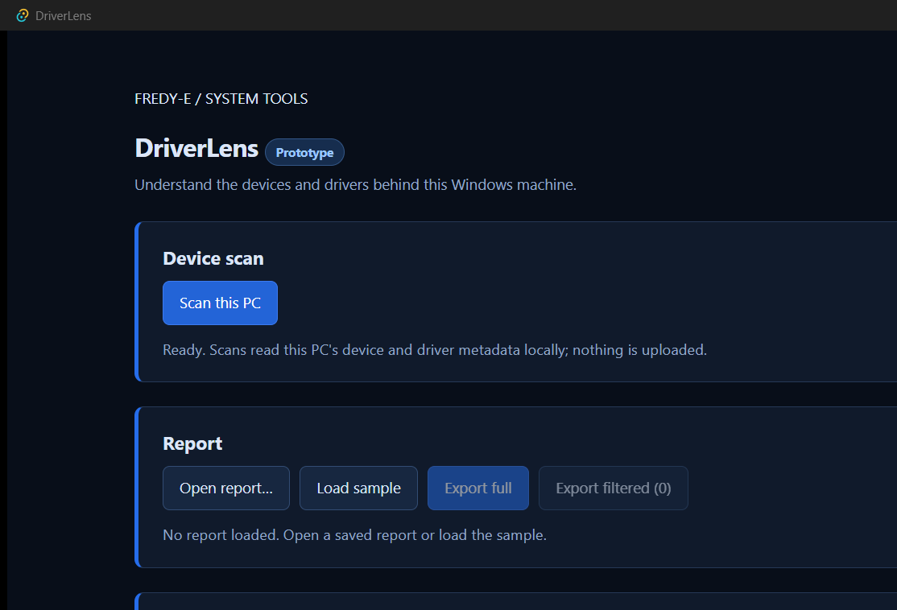
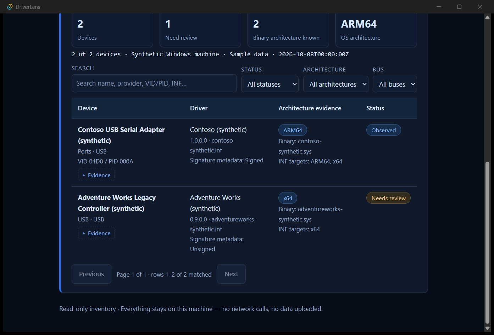
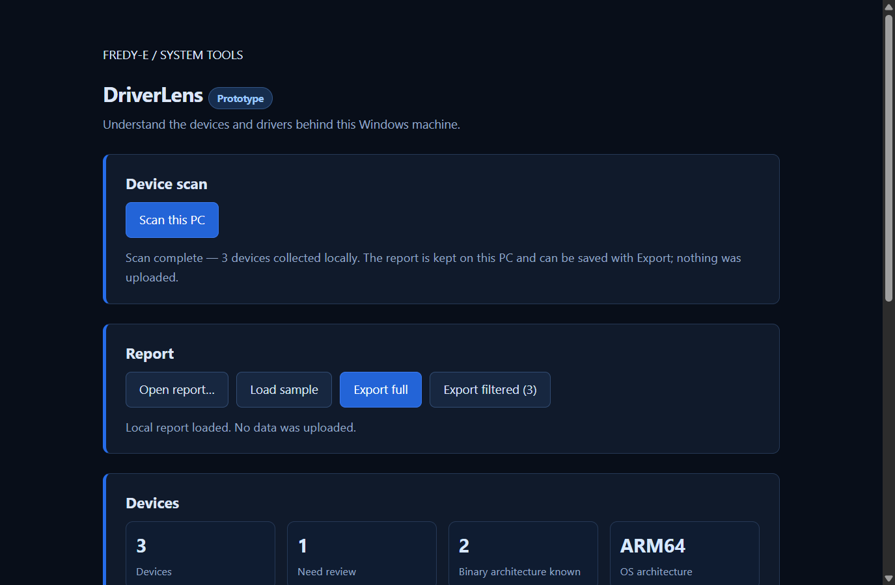
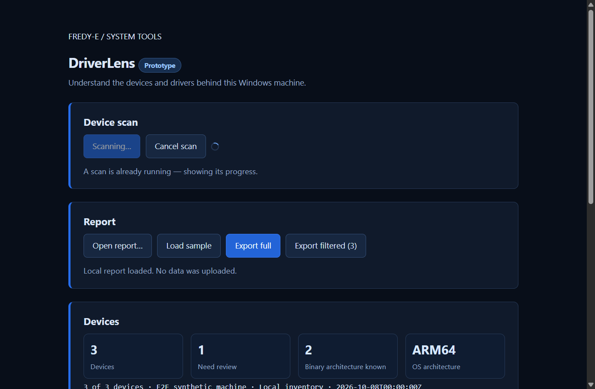
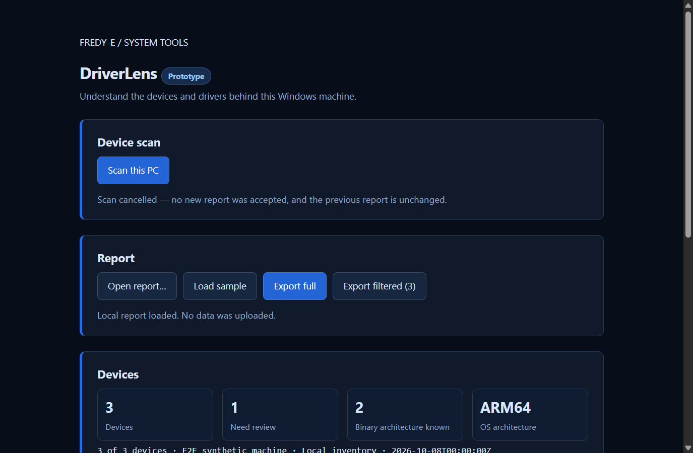
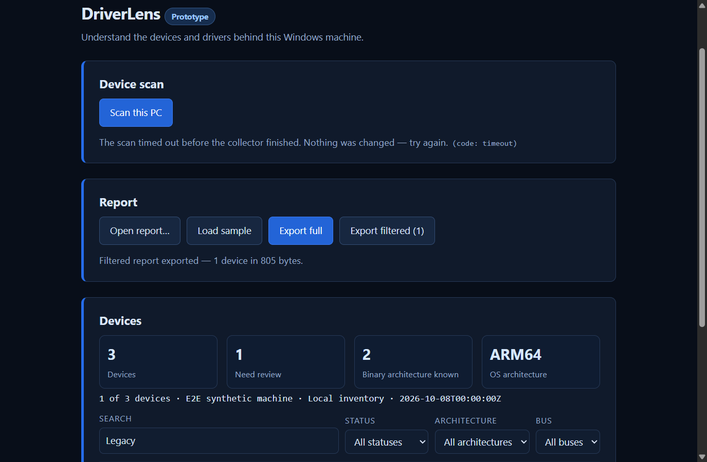

# DriverLens desktop edition

Status: **in development** (record date 2026-10-08). This document covers the desktop edition — the Tauri application under `desktop/`. The browser edition at the repository root is unchanged and keeps its own instructions in the root README.

## The two editions

| | Browser edition (repository root) | Desktop edition (`desktop/`) |
|---|---|---|
| What it is | Static page (`index.html` + `app.js`) served by a small local Node helper (`server.cjs`), launched by `Start-DriverLens.cmd` | Tauri 2.12.1 application: React 19 + TypeScript frontend, Rust core; NSIS installer (built; not yet published) |
| Collector | The same self-authored `Collect-DriverLens.ps1`, run by the local helper | The same script, bundled inside the app and spawned directly by the Rust core |
| Transport | Guarded loopback HTTP on `127.0.0.1:8781` | Tauri IPC — six narrow commands; no HTTP server in the app |
| Status | Prototype; instructions in the root README | In development; see "Verified and not verified" below |

Both editions share the same model: **read-only**, **local-only**, scans are user-initiated only (never at startup), and no telemetry.

## What is actually ARM64-native

- **The application binary.** The release build targets `aarch64-pc-windows-msvc` and produces a native ARM64 PE: `driverlens-desktop.exe`, PE machine type `0xAA64` (verified by parsing the PE header; 8,072,704 bytes, sha256 `0117946488d70fcb09269f0005d788709ecbc59bdb0e3c9a9522c05c9a3f18bd` for the current release candidate — post-fix rebuild, 2026-10-09).
- **The installer is not.** The NSIS installer (`DriverLens_0.1.0_arm64-setup.exe`, 1,911,385 bytes) is x86 — PE machine type `0x014C` — and runs under emulation on ARM64 machines; this is documented Tauri behavior ("the NSIS installer itself will still be x86 running on the ARM machine via emulation; the app itself will be a native ARM64 binary"). What it installs is the native ARM64 app above.
- The UI runs in the OS-provided **WebView2** runtime; the collector runs under **PowerShell 7** (`pwsh.exe`).

## Prerequisites

Runtime (to run the app):

- **PowerShell 7** — hosts the bundled collector. If `pwsh.exe` is not found, the scan fails with an actionable `executable_missing` message; `DRIVERLENS_POWERSHELL` can point at a trusted `pwsh.exe` (absolute path, validated).
- **WebView2 runtime** — normally included with Windows 10 (1803+) and Windows 11. The installer's default bootstrapper can fetch it when missing, which requires internet at install time.

Development (to build, not needed by end users): Node.js 22+, Rust with the `aarch64-pc-windows-msvc` target, and the VS 2022 C++ ARM64 build tools. The NSIS toolset is downloaded automatically by the bundler on the first bundle (no system NSIS required).

## Read-only scope

- The collector is **inventory-only**: it reads CIM/WMI device and driver metadata, PnP signature metadata, and the PE header of resolvable kernel driver files. It does not install, disable, modify, or remove drivers or system settings, and it never bypasses execution policy.
- The app's commands are read-only with respect to the machine: a scan reads metadata; import reads one user-picked file; export writes one user-picked file.
- **Scans are user-initiated only.** Mounting the UI starts nothing; a scan begins only on an explicit click (covered by dedicated tests).

## Local file writes

- **Scan output** is a generation-named temp file (`scan-<generation>-<random>.json`) written by the collector into the app-owned `scans` directory under the app's local data directory (`%LOCALAPPDATA%\com.fredye.driverlens\scans` on Windows) — outside the repository and outside OneDrive-synced folders. It is read into memory and **deleted after every terminal path** (success, failure, cancel, timeout); leftovers from crashed runs are purged best-effort on the next scan. The accepted report lives in memory until it is exported.
- **Import** reads exactly the file chosen in the native open dialog; on success the parsed, validated report becomes the in-memory current report.
- **Export** writes exactly the path chosen in the native save dialog: the full stored report, or — for a filtered export — exactly the selected devices, in report order, stamped with a `filterNote`.
- **Notebook store** (extension E-01) is the app's own local history file — see "USB Device Notebook" below. It lives under the app-owned local data directory and is never uploaded.
- Nothing else is written, and no report leaves the machine.

## USB Device Notebook (extension E-01)

- **What it is.** A local notebook of the devices past scans have seen, with a per-device note. It exists so you can answer "what changed on this machine?" — e.g. a driver version moving `14.0.1 -> 14.0.2` on a given date.
- **What is stored** (per device, keyed by the report's privacy digest `id`): name, VID/PID, bus, device class, `firstSeen`/`lastSeen` timestamps, the driver/status observation history (`version`, `provider`, `windowsStatus`, `errorCode`), and your note text. Never raw instance IDs, paths, usernames, or hostnames.
- **Where.** `%LOCALAPPDATA%\com.fredye.driverlens\notebook\notebook.json` — the app-owned local data directory, outside the repository and outside OneDrive-synced folders. Written atomically (temp file + rename) and **never uploaded**; nothing leaves this PC.
- **Caps.** At most **500 devices** (over the cap the least-recently-seen device is evicted), at most **100 observations per device** (oldest dropped first), consecutive-identical sightings collapse into the existing observation (a new observation is recorded only when version / provider / windowsStatus / errorCode changes; first/last-seen stay bookkeeping), and notes are capped at **4000 characters**.
- **Recording is best-effort and never fails a scan.** On scan success the accepted report is appended to the notebook on the scan thread; any store error is logged as a static message and the scan result is unaffected.
- **Viewing and editing.** The app's view switcher opens the Notebook view: recorded devices with their current driver version, Windows status, last-seen time and the latest version change; selecting a device opens its note editor. "Clear notebook" removes the store file, behind an explicit confirm step. Every control is keyboard operable.
- **Corruption behavior (honest).** A missing, unreadable, oversized or unparsable store reads as empty; the next successful write replaces it atomically. There is no sync and no backup — clearing is final.

## Scan lifecycle and failed-scan recovery

- States: `idle → running → complete / error / cancelled`. The scan runs on a dedicated thread with a **120 s deadline**; a duplicate start is refused with `busy`; cancel kills exactly the owned collector process and leaves the previous report untouched.
- **A failed scan accepts no report and keeps the previous report unchanged** — recovery is simply trying again; every terminal state permits a later scan.
- Failures map to twelve stable codes with static, actionable guidance in the UI, e.g.:
  - `timeout` → "The scan timed out before the collector finished. Nothing was changed — try again."
  - `executable_missing` → install PowerShell 7 (or set `DRIVERLENS_POWERSHELL`) and scan again.
  - `exit_failure`, `output_missing`, `too_large` (20 MiB cap), `invalid_report`, `io`.
- Caps: **20 MiB** serialized report / **20,000 devices**; oversized collector output is rejected before parsing and cleaned up.

## Evidence distinctions (what the report actually says)

- **`packageTargets`** — architecture declarations found in the driver's INF text: *declaration* evidence about the package, not proof of the loaded binary.
- **`kernelBinary` / `architecture`** — *evidence* from the resolvable kernel binary's PE machine type. It stays **Unknown** when the service path cannot be resolved, lies outside the Windows directory, or the file cannot be read. Unknown evidence is never presented as a finding.
- **`signed`** — a tri-state from Windows PnP metadata (`IsSigned`): signed / unsigned / **unknown**. It is metadata, not a fresh cryptographic verification of any file, and unknown is never coerced to "unsigned".
- "Observed" is an inventory observation, not a compatibility certification.

## Privacy limits

- The report stays on this machine: **no upload, no telemetry, no network calls in the app workflow.**
- Device digests (the `id` field) are a stable SHA-256 prefix of the uppercased device instance ID. They are **pseudonymous and linkable across reports — not anonymity**; the same device carries the same digest in every export.
- Device names, provider strings, INF names and notes are free text and **may identify specific equipment**.
- The collector omits hostnames, usernames, raw instance IDs, serial fields, and full driver paths; device names, VID/PID, provider and version remain in the report.
- Do not describe reports as "anonymous" — they are local and pseudonymous at best.

## Screenshots

All images below are of the real native interface. No real device data was ever collected or displayed: the scan captures ran against a **scripted synthetic collector** during the native E2E run, and the sample capture shows the **bundled fictional sample**.

  
   <b>desktop-start.png</b> — Startup state. Window-content capture (PrintWindow with PW_RENDERFULLCONTENT) of the release binary (the 2026-10-08 build, captured before the 2026-10-09 collector fix; the UI is unchanged by that fix), launched from a scratch copy so the build output was untouched. The interactive session was locked, so a screen capture was not possible; the window content itself is fully rendered. No report loaded; no scan was started.

  
   <b>desktop-sample.png</b> — The bundled fictional sample loaded in the release binary: the device table with the synthetic Contoso / Adventure Works rows, signature-metadata and architecture badges, and the INF-targets vs binary-evidence columns. Produced on a scratch copy of the release binary by invoking "Load sample" through UI Automation, then a PrintWindow window-content capture (session locked; scrolled to the table). All data is fictional.

  
   <b>desktop-scan-success.png</b> — After a successful scan in the native WebDriver E2E run (post-cleanup build, 2026-10-08): the real Tauri window driven over the embedded WebDriver server, with a scripted synthetic collector (3 devices; the footer reads "E2E synthetic machine"). Captured by the E2E session (webview content only — no OS window chrome).

  
   <b>desktop-scan-busy.png</b> — A duplicate start while a scan is already running: the UI shows the busy notice and keeps Cancel available. Same native E2E capture method.

  
   <b>desktop-scan-cancelled.png</b> — Cancellation: "Scan cancelled — no new report was accepted, and the previous report is unchanged." Same native E2E capture method.

  
   <b>desktop-filtered-export.png</b> — Timeout guidance plus a completed filtered export of one device (synthetic; "Filtered report exported — 1 device in 805 bytes"). Same native E2E capture method.

## Development runbook

- **[NATIVE-E2E.md](NATIVE-E2E.md)** — how to build the E2E binary (`--features wdio-e2e`, `CARGO_TARGET_DIR=src-tauri/target-e2e`), run the native suite (`npm --prefix desktop run test:native`), the environment contract, and the harness quirks.
- **[DEPENDENCIES.md](DEPENDENCIES.md)** — pinned npm and Rust dependencies with the reasoning.
- **[EXPORT-FILTERED.md](EXPORT-FILTERED.md)** — the filtered-export contract.
- **[DESKTOP-VERIFICATION.md](DESKTOP-VERIFICATION.md)** — the verification record: the Task 14 release record, the 2026-10-09 post-verification fix (§0: the verbatim-path bug, the fix, and the manual real scan) with the post-fix re-verification, current artifact hashes (§5/§7), and the clean-machine matrix (all UNVERIFIED).
- The root README's "Checks" section covers the browser edition; `desktop/` checks are `npm --prefix desktop run test`, `typecheck`, `build`, and `cargo test` in `desktop/src-tauri`.

## Verified and not verified (as of 2026-10-09)

**Verified** (full battery PASS, re-run green after the 2026-10-09 collector fix; full record in [DESKTOP-VERIFICATION.md](DESKTOP-VERIFICATION.md) and the evidence logs): 169 frontend tests across 15 files, 77 Rust tests (67 unit + 10 IPC-boundary integration), 7 bundle/static checks, typecheck and build; a 12-case native WebDriver E2E run that drives the real compiled window and the real IPC boundary (all 12 passed; scripted synthetic collectors; re-run green post-fix); the release binary's PE machine type `0xAA64` and the NSIS installer's x86 stub (`0x014C`) — both as expected; the production installer built and inspected (1.82 MiB; unsigned); the app launches and opens no HTTP port; the post-fix release binary completed a **manual real scan** on this machine (277 devices, read-only, local — count only; DESKTOP-VERIFICATION.md §0).

**Not verified**: **no clean-machine verification has happened** — install, first-launch, upgrade, uninstall, SmartScreen and missing-WebView2 behavior are all **UNVERIFIED** (no VM available in this environment); the installer is **unsigned** (`NotSigned`; no certificate configured) — expect a SmartScreen warning if it is downloaded via a browser; no **hardware matrix** beyond this one ARM64 machine (x86/x64 devices untested; the manual scan is a single-machine observation); the E2E suite cannot prove real hardware inventory or real collector behavior on a device. No desktop release is published.
